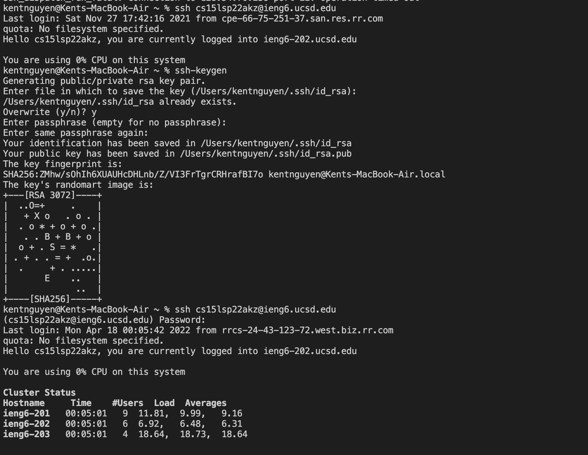
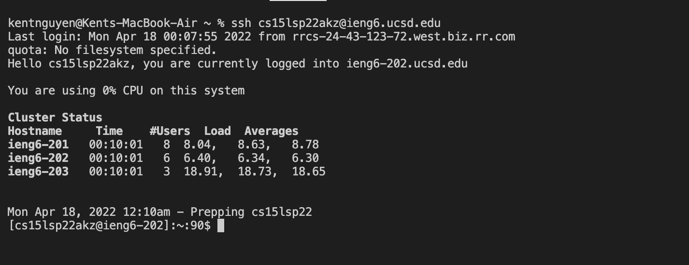
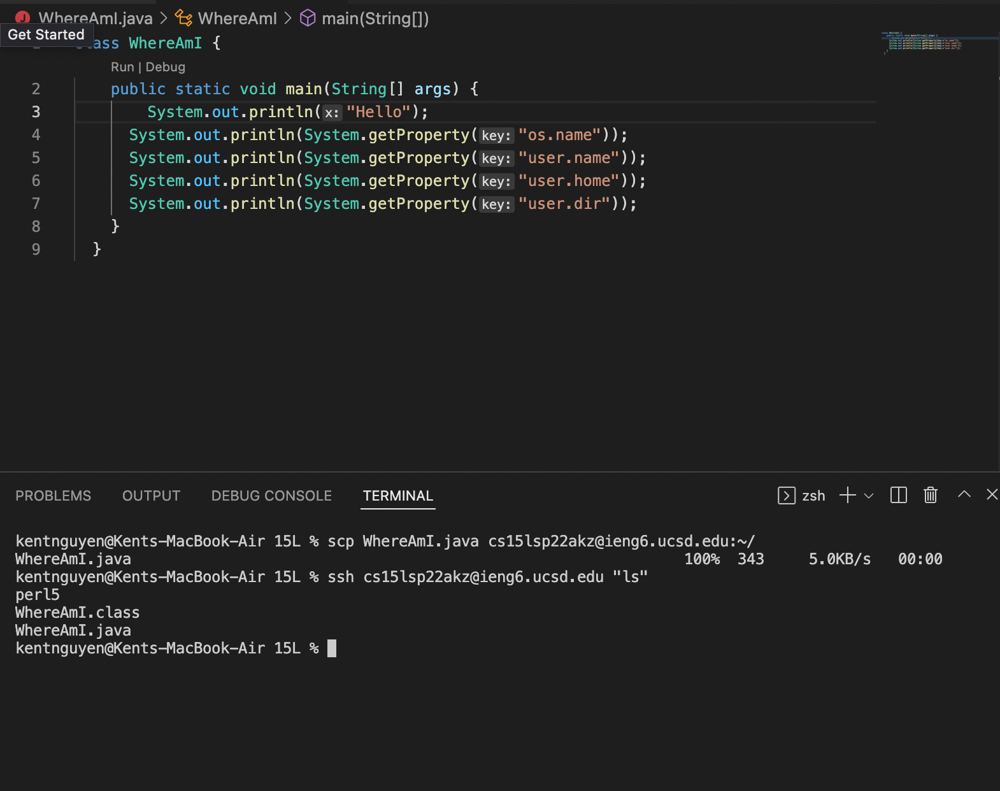

# Installing VS Code

- Installing VS code was easy, simply navigated to the VS code website and then installed the program.
- Attached is my VS code startup window.

# Remotely Connecting

- I am on MacOS so I did not have to install OpenSSH, but I did have to prepare my course-specific account for CSE 15L by resetting the password.
- I connected to the server through my local device with `ssh cs15lsp22akz@ieng6.ucsd.edu`
- I had to answer some simple questions and ended up getting connected as shown in the screenshot above.

# Trying Some Commands

- I began with trying out the command `cd ~`, which allows the user to change their working directory.
- I then tried out two commands `cp /home/linux/ieng6/cs15lsp22/public/hello.txt ~/` and `cat /home/linux/ieng6/cs15lsp22/public/hello.txt`, but my permission was denied.
- he first command allows the user to copy files or directories, while the second command allows the user to concatenate files.
- I also tried `ls` which is a command that lists files.

# Moving Files with scp

- Created a file called WhereAmI.java which prints out the information of the User's file pertaining to their OS.
- I then moved the file to the local file into the server with the command `scp WhereAmI.java cs15lsp22akz@ieng6.ucsd.edu:~/`

# Setting an SSH Key

- Created an SSH Key for my device with command `ssh-keygen`

- Logged into server with password and used command `mkdir.ssh`. Then back on my client I used the command `scp /Users/Kent/.ssh/id_rsa.pub cs15lsp22akz@ieng6.ucsd.edu:~/.ssh/authorized_keys` which then allowed me to login with the usual 'ssh' command without a password.

# Optimizing Remote Running

- When I timed myself before, I took around 55 seconds to make the file, copy and list the files.
- Now eding the file and then using the same command, `scp WhereAmI.java cs15lsp22akz@ieng6.ucsd.edu:~/`, following with using `ssh cs15lsp22akz@ieng6.uscd.edu "ls"` took me only 31 seconds.
- Having to not enter in the password and adding the command after the login information allowed me to be more efficient and save time.
