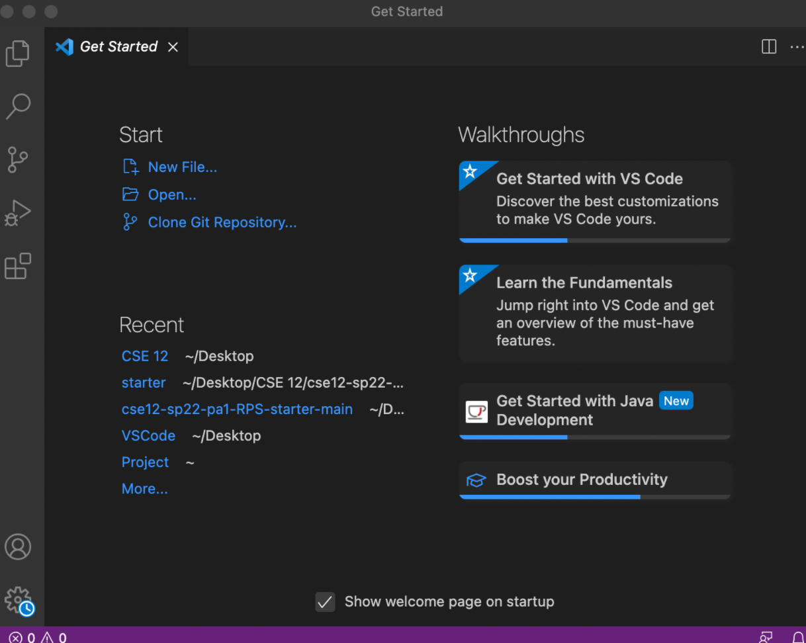
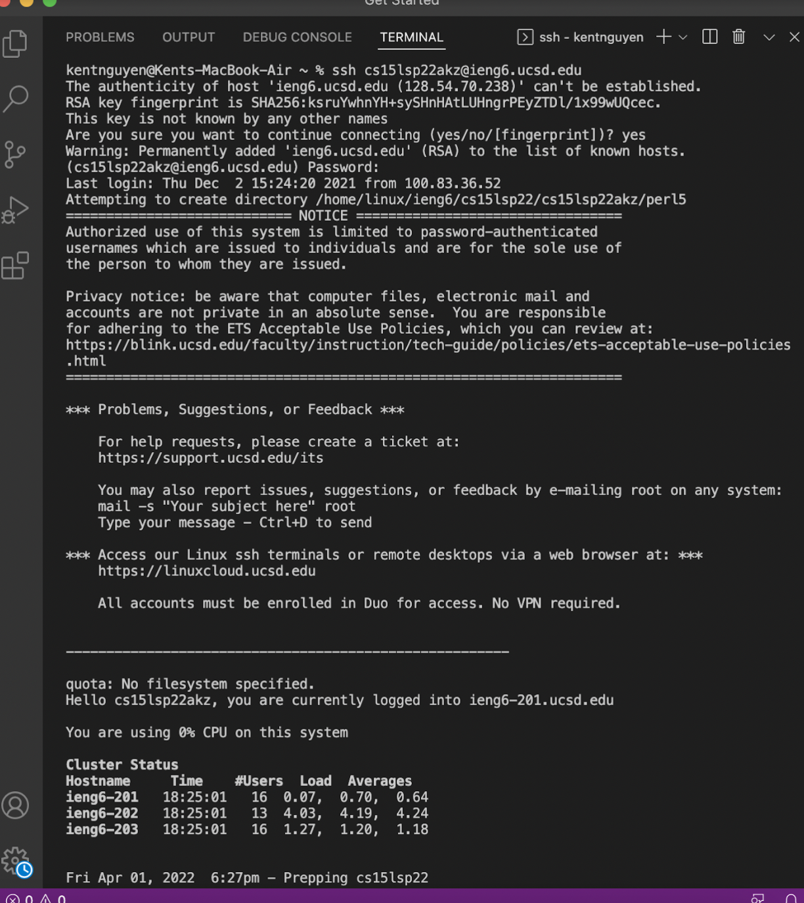
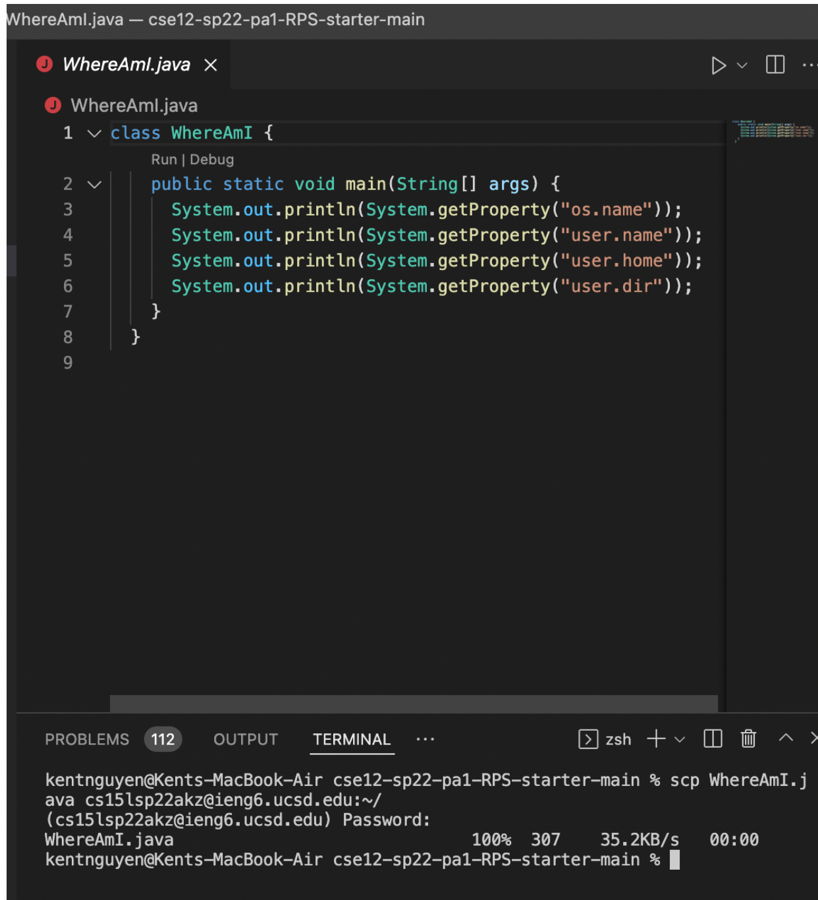
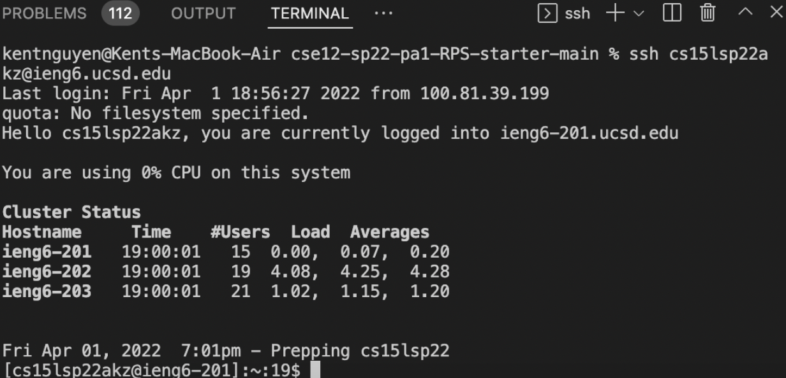
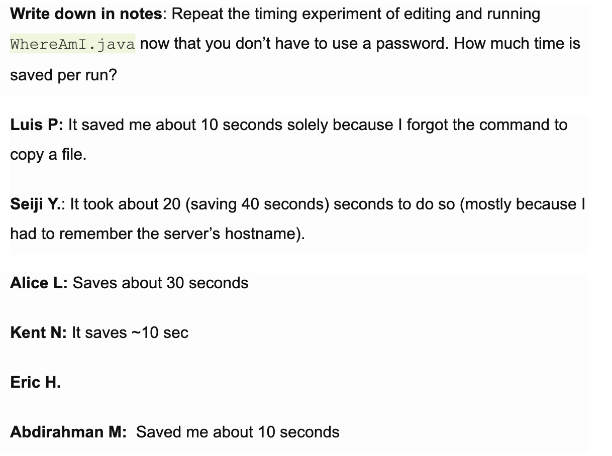

# Installing VS Code

- Installing VS code was easy, simply navigated to the VS code website and then installed the program.
- Attached is my VS code startup window.

# Remotely Connecting

- I am on MacOS so I did not have to install OpenSSH, but I did have to prepare my course-specific account for CSE 15L by resetting the password.
- I connected to the server through my local device with $ssh cs15lsp22akz@ieng6.ucsd.edu.
- I had to answer some simple questions and ended up getting connected as shown in the screenshot above.

# Trying Some Commands

- I began with using the command cd
- CD allows the user to change directories.

# Moving Files with scp

- Created a file called WhereAmI.java
- Moved the file from my local device to the server.

# Setting an SSH Key

- Created an SSH Key for my device.
- Able to login without a password.

# Optimizing Remote Running

- Able to edit and run WhereAmI.java quicker without entering in a password each time.
- Saved ~10 seconds.
