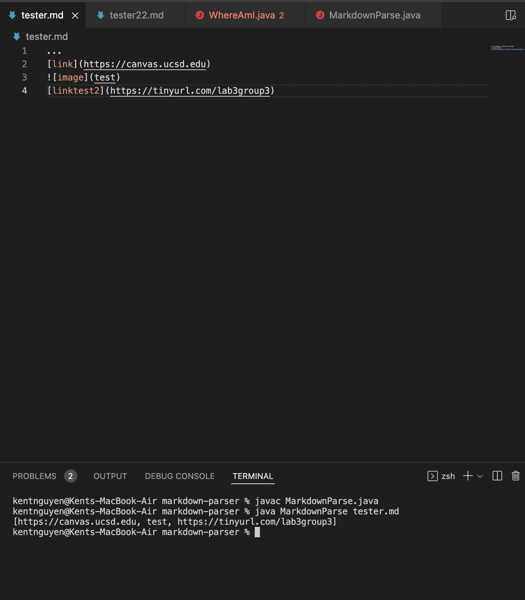
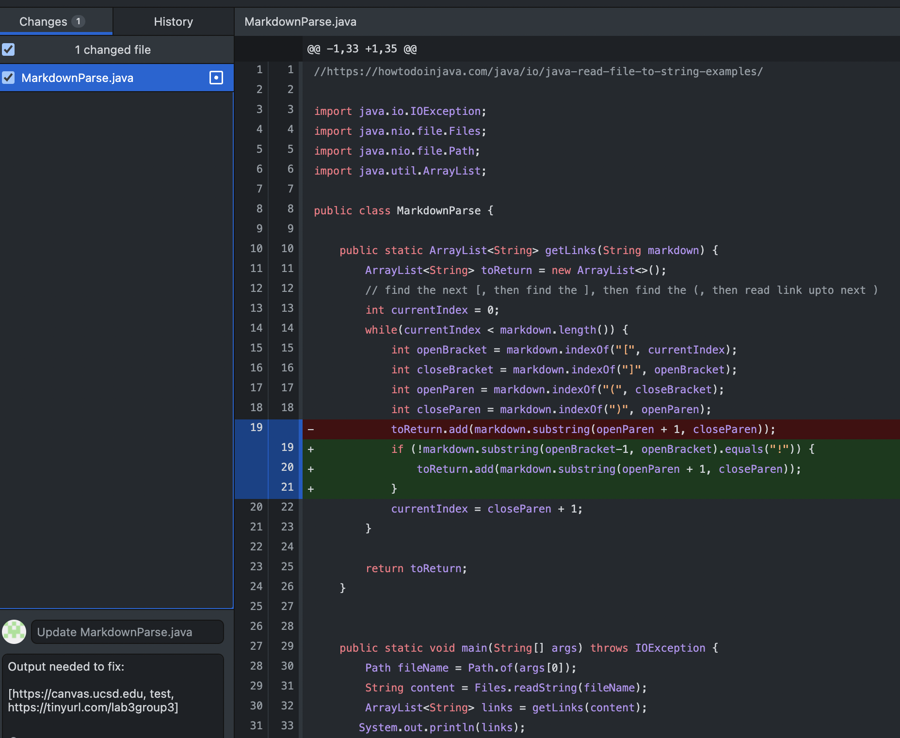
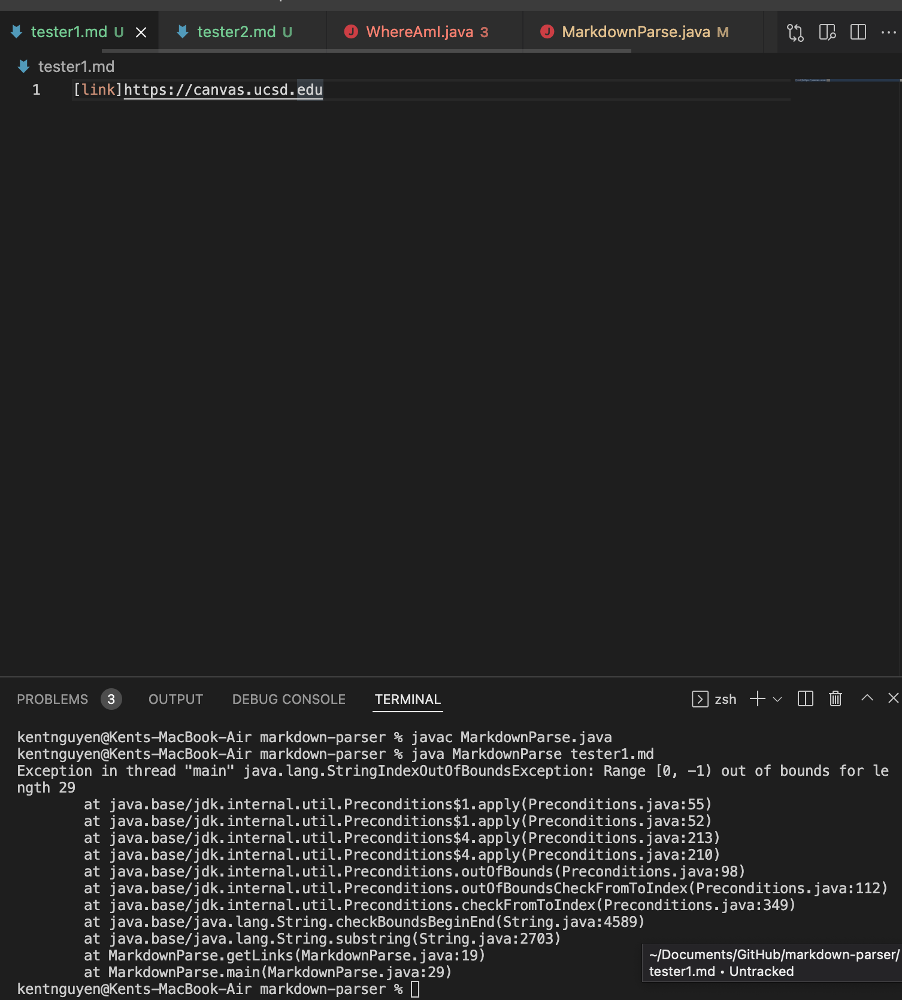
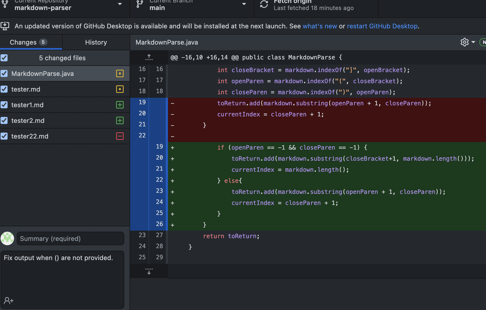
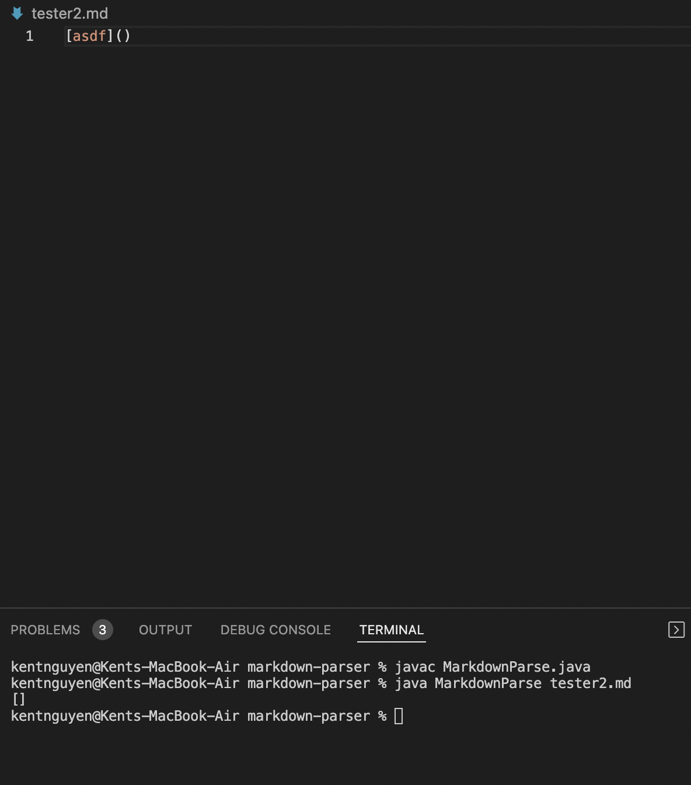
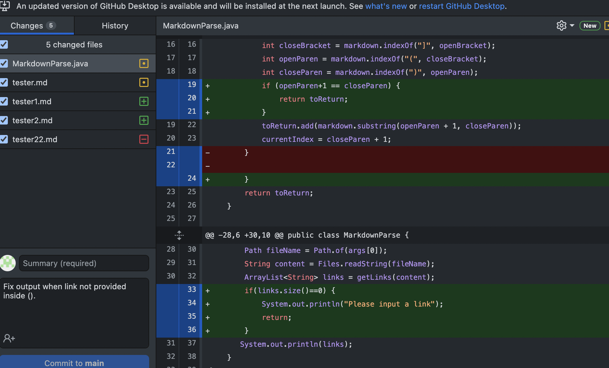

## Bug + Code Change 1

- Above the fail inducing input is the `!` line of code that comes when inserting an image. The symptom causes the program to still take the image and print it out as if it was a URL. A simple fix was this was to check for an !.

## Bug + Code Change 2

- The fail inducing input is inputting a link without both () which gave an out of bounds bug. The symptom is the code that is trying to read the indexes after ( and ) which are out of bound.

## Bug + Code Change 3

- The fail inducing input is simply not adding a link. The symptom is the code does not recognize no link is added and still prints out the bracket. Simply adding a `Please input a link` message and stopping the program instead of printing out `[]` was my idea of a fix.

