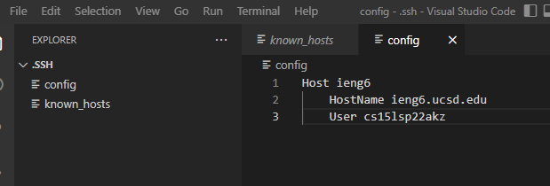
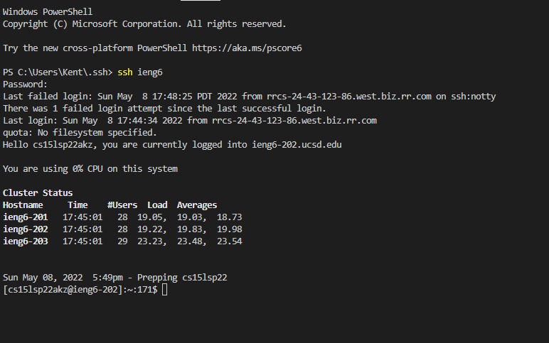
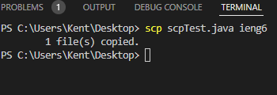
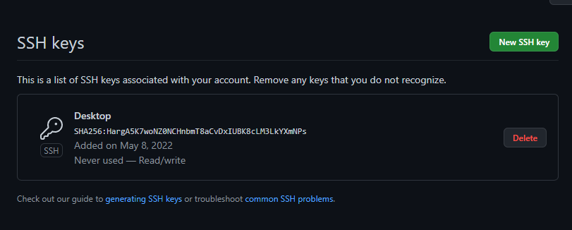
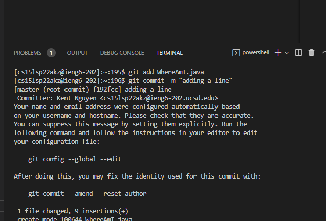
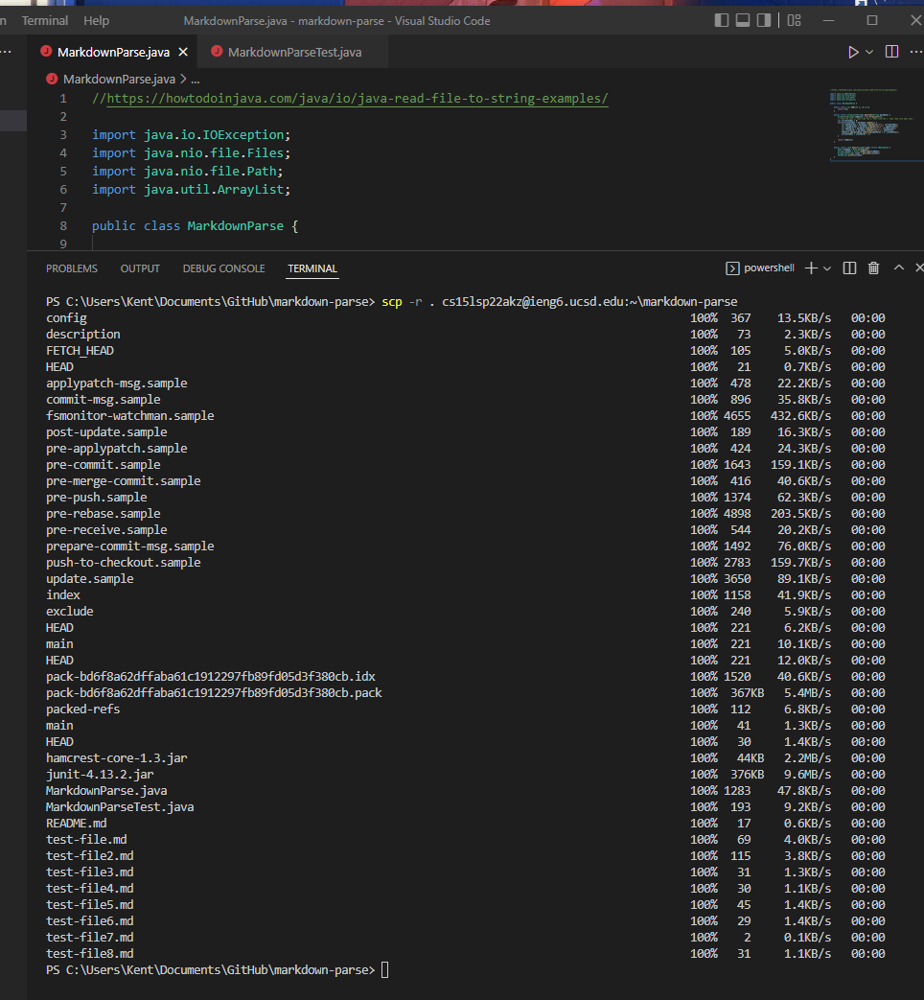
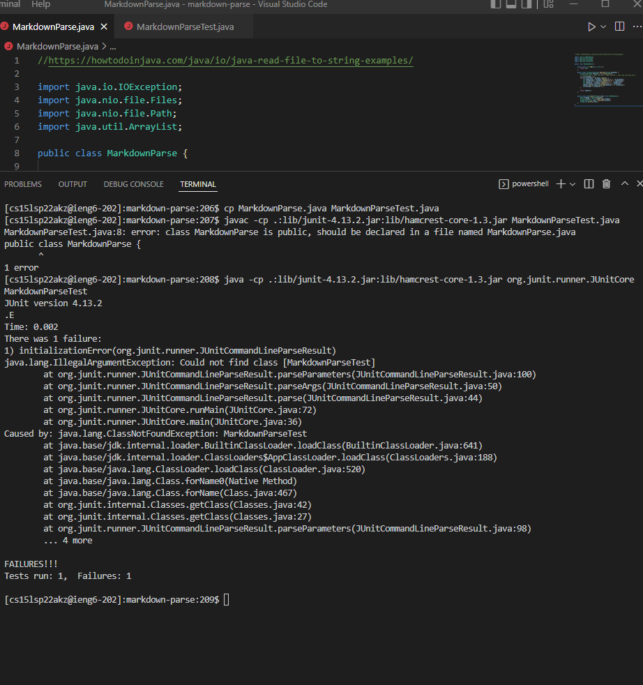
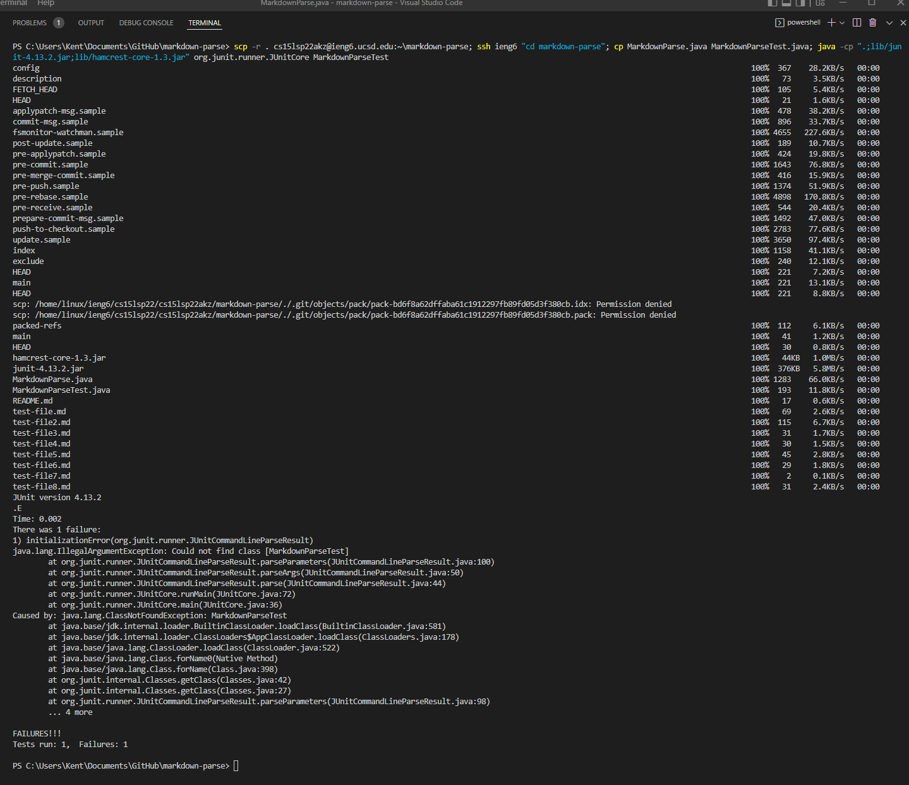

## Streamlining ssh Configuration

- I located the .ssh directory and created the config file via VS code with the following:
`Host ieng6
    HostName ieng6.ucsd.edu
    User cs15lsp22akz`
- I decided to not change my alias and leave it as is.

- Logged in via `ssh ieng6`, a much simpler and quicker command in comparison to `ssh cs15lsp22akz@ieng6.ucsd.edu`

- I created a simple scpTest.java file on my desktop via VSCode to test the `scp` command.
- Used the command `scp scpTest.java ieng6`, which copied the source file to the destination.

## Setup Github Access from ieng6

## Copy whole directories with `scp -r`

``
