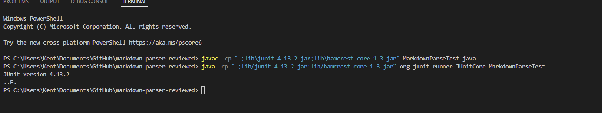

My Markdown-parse: [markdown-parse](https://github.com/nguyennkent/markdown-parser)

My MarkdownparseTest.java

- Passed snippet 1
- Convert the string via String.toArray and then iterate over that array to replace everything right of ` until meeting the close parenthesis and returning that string.

Failed Tests

- Did not pass Snippet 2

- This would take a bigger code change to make MarkdownParse work for this test case because we would have to separate the nested link outside and iterate through to ignore the nested link and return the b.com output alongside. Not only that but then we would need to cover the nested parenthesized url which is another implementation itself.

- Did not pass Snippet 3

- Passing the test could be easily implemented by adding an implementation to search for the next close parenthesis for both outputs that failed. Run through the test file until a ) is found. 

Reviewed: [reviewed](https://github.com/Shresthhooda/markdown-parser)

Reviewed MarkdownparseTest.java

- Was not able to run the tester.

- I think this is due to the nature of their while loop never breaking out of the while loop and reaches the return.

