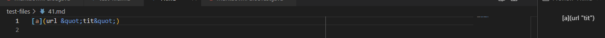
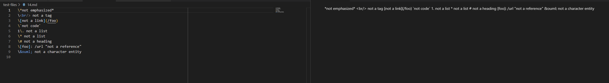

## How I found different test results
- Editing MarkdownParse file to print the test file name and then utilized `time bash script.sh` command to run all the test files and then chose the test files I wanted.

## Link of test file with different results
[Test file 41](https://raw.githubusercontent.com/nidhidhamnani/markdown-parser/main/test-files/41.md)

[Test file 14](https://raw.githubusercontent.com/nidhidhamnani/markdown-parser/main/test-files/14.md)

## Test 41

- To the left is the test-file and the right is the previewed output.
- The output should produce [] because there are no valid url or links in the parenthesis.

## Test 14

- To the left is the test-file and the right is the previewed output.
- The output should produce [] because there are no valid url or links in any of the lines provided.